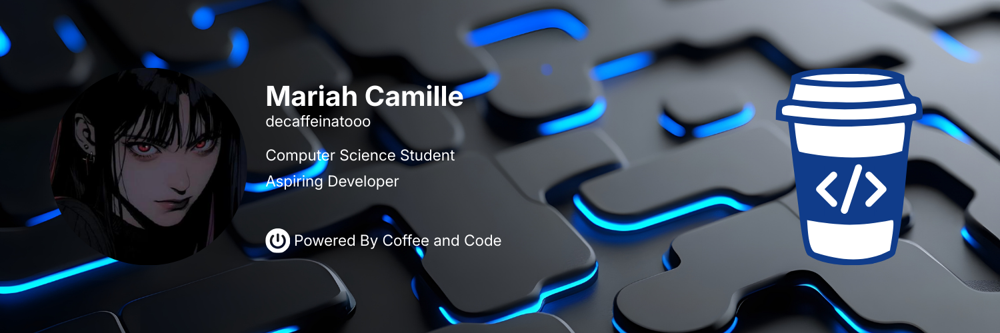

  

<h1 align="center">
  
</h1>

  <strong>Computer Science Student @ University of San Carlos</strong> 
  <em>Passionate about building scalable web solutions and fostering tech communities.</em>

  
  

---

### 🖋️ About Me
I am a self-motivated **Computer Science** undergraduate dedicated to bridging the gap between complex logic and user-centric design. **Currently serving as the Public Relations Officer for Innovare: USC Competition Guild**, where I manage external communications and help grow the student developer community. I also **create skits and video content** for social media platforms like **Instagram, TikTok, and Facebook**, showcasing events, projects, and community highlights.

---

### 🛠️ Technical Proficiency

| Category | Technologies |
| :--- | :--- |
| **Languages** | `JavaScript` `TypeScript` `Python` `Java` `C` `C#` |
| **Frontend** | `React` `Tailwind CSS` `HTML5` `CSS3` |
| **Backend** | `Node.js` `.NET MAUI` `PostgreSQL` |
| **Cloud/Sec** | `Cisco Networking` `Cybersecurity Fundamentals` |

---

### 🛡️ Certifications
* **CISCO:** Introduction to Cybersecurity [View Badge](https://www.credly.com/badges/1e4bcfb2-55d6-4f3f-9887-c221b28ed194)
* **CISCO:** CCNA – Switching, Routing, and Wireless Essentials [View Badge](https://www.credly.com/badges/bfe7d4ea-fb91-4e64-826f-6012027657fe)

---
### 🤝 Connect with me

  
  

  

